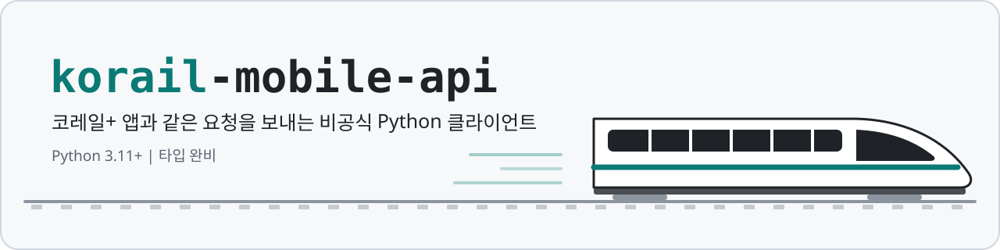
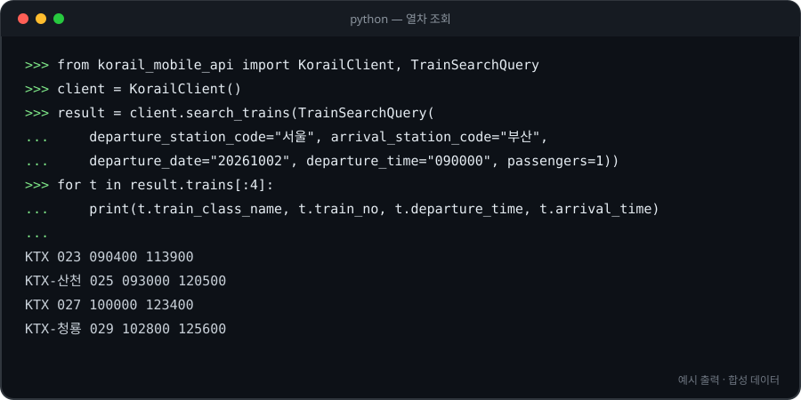
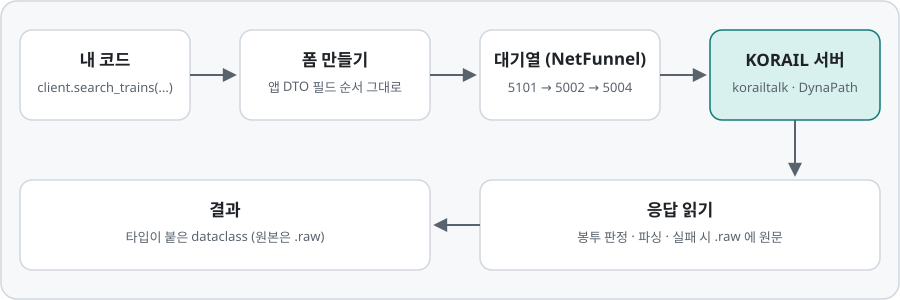

> [!IMPORTANT]
> ## 🚆 The Journey Begins Again
>
> ### **여기서, 여정이 다시 시작됩니다.**
>
> 2026년 9월 1일, KORAIL과 SR이 통합되면서 SRT 열차는 KTX로 합쳐졌고, 코레일톡도 코레일+로 바뀌었습니다.
> 두 갈래로 이어져 오던 서비스가 하나의 선로 위에서 만난 것처럼,
> **[`srt-mobile-api`](https://github.com/yakisoba0728/srt-mobile-api)의 개발과 기록도
> 이제 `korail-mobile-api`로 이어집니다.**
>
> `srt-mobile-api`는 여기서 멈췄지만, 그 안에서 확인한 수많은 요청과 응답,
> 시행착오와 검증의 기록까지 사라지는 것은 아닙니다.
> 그 경험은 이 프로젝트의 다음 장을 이루는 기반으로 남습니다.
>
> **우리는 SRT를 기억할 것입니다.**  
> 하나의 프로젝트는 종착역에 도착했지만, 그 여정은 이곳에서 다시 출발합니다.
>
> **One journey ended. Another begins here.**
>
> → [`srt-mobile-api` — Final Stop](https://github.com/yakisoba0728/srt-mobile-api)

<p align="center">
  <picture>
    <source media="(prefers-color-scheme: dark)" srcset="docs/assets/banner-dark.svg">
    
  </picture>
</p>

<p align="center">
  <a href="https://github.com/yakisoba0728/korail-mobile-api/actions/workflows/ci.yml"></a>
  
  
  
  <a href="LICENSE"></a>
</p>

<p align="center">
  <a href="https://yaki.kr/korail-mobile-api/">문서</a> ·
  <a href="#설치">설치</a> ·
  <a href="#빠르게-써보기">빠르게 써보기</a> ·
  <a href="#예약결제환불">예약·결제·환불</a> ·
  <a href="#지원-범위">지원 범위</a> ·
  <a href="#동작-방식">동작 방식</a> ·
  <a href="#법적-고지">법적 고지</a>
</p>

코레일+ 안드로이드 앱이 서버에 보내는 요청을 그대로 따라 하는 비공식 Python 클라이언트입니다.
2026년 9월 KORAIL과 SR이 통합되면서 SRT는 KTX로 합쳐졌고, 코레일톡도 코레일+로 이름이 바뀌었습니다.

KORAIL과는 관계없는 개인 프로젝트입니다. 공식 API가 아니라서 KORAIL이 서버나 앱을 바꾸면 언제든 깨질 수 있습니다.
쓰기 전에 [법적 고지](#법적-고지)는 꼭 읽어 주세요.

- **타입이 붙은 응답** — 응답은 전부 dataclass로 돌려주고, 서버가 준 원본은 `.raw`에 남겨 둡니다.
- **실수하기 어렵게** — 결제 금액이 홀드와 맞는지, 0원·예약대기 홀드를 카드로 결제하려는 건 아닌지, 환불 전에 수수료를 조회했는지 요청 전에 확인합니다.
- **네트워크 없이 도는 테스트 2,100여 개** — CI에서 Python 3.11~3.14로 `pytest`, `mypy --strict`, `pyright`, `ruff`를 돌립니다.

## 설치

Python 3.11 이상이 필요합니다. PyPI에는 올리지 않았고 GitHub에서 바로 설치합니다.

```sh
pip install "git+https://github.com/yakisoba0728/korail-mobile-api"
```

의존성은 `httpx`와 `cryptography` 두 개뿐입니다.

## 빠르게 써보기

열차 조회는 로그인 없이 됩니다.

```python
from korail_mobile_api import KorailClient, TrainSearchQuery

client = KorailClient()
try:
    query = TrainSearchQuery(
        departure_station_code="서울",
        arrival_station_code="부산",
        departure_date="20261002",
        departure_time="090000",
    )
    result = client.search_trains(query)
    for t in result.trains:
        print(t.train_class_name, t.train_no, t.departure_time, t.arrival_time)
finally:
    client.close()
```

<p align="center">
  
</p>

역은 이름이나 역 코드 어느 쪽으로 넣어도 됩니다. 날짜는 `YYYYMMDD`, 시각은 `HHMMSS`입니다.
결과는 한 페이지씩 오니까 다음 열차는 `client.search_trains(query, continuation=result.next_page())`로 이어서 받으면 됩니다.

로그인하면 내 승차권과 예약 내역도 볼 수 있습니다.

```python
from getpass import getpass

from korail_mobile_api import KorailClient

client = KorailClient()
try:
    client.login(input("회원번호·전화번호·이메일: "), getpass("비밀번호: "))
    tickets = client.get_ticket_list()
    print(sum(len(r.tickets) for r in tickets.reservations), "장")
finally:
    client.logout()
    client.close()
```

로그인 ID는 하이픈 없는 회원번호·전화번호나 이메일입니다. 로그인에 실패하면 계정 잠금 횟수에 들어갈 수 있으니 조심하세요.

## 예약·결제·환불

**이 메서드들은 부르는 순간 실제로 처리됩니다.** 확인 창이나 미리보기 같은 건 없습니다.
예약하면 좌석이 잡히고, 결제하면 카드가 실제로 청구되고, 환불에는 수수료가 붙을 수 있습니다.

| 하려는 것 | 메서드 | 알아둘 점 |
|---|---|---|
| 좌석 잡기 (결제 전) | `reserve`, `reserve_transfer`, `reserve_merge`, `reserve_limousine` | 승객 구성은 조회할 때와 같게 넣습니다. |
| 결제 전 취소 | `cancel_unpaid_hold` | 결제한 표에는 쓰지 않습니다. |
| 카드 결제 | `pay_with_card` | 카드 거절은 예외가 아니라 FAIL 응답으로 돌아옵니다. |
| 환불 | `get_refund_commission` → `refund(..., commission=...)` | 승차권 한 장씩이고, 수수료 조회가 먼저입니다. |
| 할인 재계산 | `PriceRecalculationRequest.for_hold` → `recalculate_price` | 결제는 재계산된 홀드로 합니다. |

변경 요청은 자동으로 다시 보내지 않습니다. 응답을 못 읽어서 예외가 나도 서버에서는 이미 처리됐을 수 있습니다.
그럴 땐 다시 보내지 말고 예외의 `.raw`나 `get_reservation_history()`로 먼저 확인하세요.

## 지원 범위

공개 메서드는 84개이고, 2026년 9월 24~26일에 실서버로 하나씩 확인했습니다.

| 영역 | 메서드 | 실서버 확인 | 예 |
|---|---:|---:|---|
| 로그인·세션 | 4 | 2 | `login`, `logout` (나머지 둘은 네트워크를 쓰지 않음) |
| 공통 정보 | 9 | 9 | 역 목록, 운행 달력, 공지 |
| 열차 조회·좌석 | 12 | 11 | `search_trains`, 환승 조회, 호차·좌석 배치, 운임 |
| 공항버스·부가서비스 | 6 | 6 | 공항버스 스케줄·좌석, 부가서비스 메뉴 |
| 정기권·패스 | 6 | 6 | 패스 사용 가능일, 정기권 조건 |
| 내 승차권·계정 | 28 | 21 | 승차권 목록, 예약 내역, 영수증, 마일리지, 지연확인증 |
| 예약·결제·환불 | 19 | 11 | `reserve`, `pay_with_card`, `refund` |

확인 못 한 것 중 4개는 요청은 서버까지 갔지만 이 계정에 해당 자료가 없어서 오류 코드만 봤습니다.
나머지 12개는 필요한 카드나 승차권이 없어서 아예 보내 보지 못했습니다. 코드는 앱과 똑같이 짰지만 성공 응답은 본 적이 없습니다.

- N카드: 구매, 기간 연장, N카드로 예약, 사용 내역, 이용 가능 열차, 2인 승차권 수령자 조회
- 셀프 체크인: 좌석 확인, 등록, 취소
- 역에서 산 승차권 환불: 확인, 실행
- 다른 회원에게 전달한 승차권 회수

간편 로그인(카카오·네이버 등), 여행상품 검색·결제, 부가서비스 구매는 지원하지 않습니다.
앱에서 필요한 값이 암호화돼 있거나 외부 SDK를 거쳐야 해서입니다.

## 동작 방식

<p align="center">
  <picture>
    <source media="(prefers-color-scheme: dark)" srcset="docs/assets/flow-dark.svg">
    
  </picture>
</p>

- 폼은 앱의 요청 DTO에 선언된 순서대로 만듭니다. 앱이 그 순서로 보내기 때문입니다.
- 조회·예약·결제 전에는 앱처럼 NetFunnel 대기열을 거칩니다. 기본으로 켜져 있습니다.
- 로그인 비밀번호는 앱처럼 AES로 암호화해서 보냅니다.
- 응답을 못 읽으면 받은 원문 전체를 예외의 `.raw`에 담아 던집니다.

더 자세한 규칙과 앱과 다르게 처리한 부분은 [checks/BEHAVIOR.md](checks/BEHAVIOR.md)에 정리해 뒀습니다.

## 자주 묻는 질문

**SRT는요?**
SRT는 2026년 9월 통합 때 KTX로 합쳐져서 이제 따로 없습니다. 예매는 코레일+ 앱 하나로 하고, 이 라이브러리도 그 앱의 요청을 씁니다.
SRT 앱용으로 만들었던 [srt-mobile-api](https://github.com/yakisoba0728/srt-mobile-api)는 개발을 멈추고 이 저장소로 이어졌습니다.

**PyPI에서 설치할 수 있나요?**
아니요. 위의 GitHub 설치 명령을 쓰세요.

**대기열을 끄면 빨라지나요?**
`KorailConfig(netfunnel_enabled=False)`로 끌 수는 있습니다. 하지만 앱과 다르게 동작하게 되고 KORAIL의 혼잡 제어를 건너뛰는 셈이라 권하지 않습니다.

**비밀번호나 카드 번호는 어디에 저장되나요?**
어디에도 저장하지 않습니다. KORAIL 서버로만 보내고 파일로 쓰지 않습니다.
다만 응답 모델과 예외의 `.raw`에는 개인정보가 그대로 들어 있으니 로그에 그대로 찍지 않도록 조심하세요.

## 문서와 링크

- [문서 사이트](https://yaki.kr/korail-mobile-api/) — 시작하기, 가이드, 메서드 84개 전체의 API 레퍼런스
- [동작 규칙 (checks/BEHAVIOR.md)](checks/BEHAVIOR.md) — 요청을 만드는 규칙, 응답을 읽는 규칙, 앱과 다르게 한 부분
- [변경 이력 (CHANGELOG.md)](CHANGELOG.md)
- [오프라인 검사 기준 (checks/ACCEPTANCE.md)](checks/ACCEPTANCE.md)
- 한국철도공사 공식 홈페이지 — <https://www.korail.com>
- 코레일+ 앱 — [Google Play](https://play.google.com/store/apps/details?id=com.korail.talk) · [App Store](https://apps.apple.com/kr/app/id1000558562)
- 이전 SRT 클라이언트 — [srt-mobile-api](https://github.com/yakisoba0728/srt-mobile-api)

## 개발

```sh
git clone https://github.com/yakisoba0728/korail-mobile-api
cd korail-mobile-api
pip install -e ".[dev]"

pytest
ruff check src checks tests && ruff format --check src checks tests
mypy && pyright
python checks/contract_api.py && python checks/netfunnel_offline.py
```

테스트는 전부 가짜 응답으로 돌고 소켓을 막아 둬서 실수로 실서버에 요청이 나가지 않습니다.
버그나 앱 업데이트로 달라진 부분을 찾으면 이슈로 알려 주세요.

## 법적 고지

- 이 프로젝트는 한국철도공사(KORAIL)와 관계없는 개인의 비공식 프로젝트이며, 후원·승인·지원을 받지 않았습니다. 통합 전의 (주)에스알(SR)과도 관계없습니다.
- KORAIL, 코레일, 코레일+, 코레일톡, KTX, SRT 등의 이름과 상표는 각 권리자의 것입니다. 이 저장소는 무엇과 호환되는지 설명하려고 이름만 씁니다. 저장소의 이미지는 직접 만들었고 공식 로고는 쓰지 않았습니다.
- 저장소에는 앱 설치 파일(APK)이나 디컴파일한 앱 소스를 넣지 않았습니다. 라이브러리는 앱과 호환되도록 요청 형식만 재현합니다.
- 이 라이브러리로 하는 예약·결제·환불은 전부 실제 거래입니다. 그 결과와 비용은 사용자 책임입니다.
- KORAIL 서비스를 쓸 때는 KORAIL의 이용약관과 여객운송약관을 따라야 합니다. 자동화된 방식으로 쓰는 것이 약관에 맞는지는 사용자가 직접 확인해야 합니다.
- KORAIL은 매크로 탐지 시스템을 운영하고 있습니다. 자동 프로그램 사용이 의심되면 로그인·조회 단계부터 접속을 막고, 대량 구매·취소에 쓰인 카드는 1년 동안 승차권 결제를 제한한다고 밝혔습니다([2025년 10월 보도](https://www.paxetv.com/news/articleView.html?idxno=248146)).
- 승차권을 상습적으로 또는 영업으로 산 값보다 비싸게 되팔거나 이를 알선하는 행위는 [철도사업법 제10조의2](https://www.law.go.kr/%EB%B2%95%EB%A0%B9/%EC%B2%A0%EB%8F%84%EC%82%AC%EC%97%85%EB%B2%95)로 금지돼 있고, 최대 1천만 원의 과태료가 부과될 수 있습니다. 이 라이브러리를 암표, 좌석 선점, 대량 예매에 쓰지 마세요.
- 계정과 카드 정보 관리는 사용자 몫입니다. 라이브러리는 로그나 `.raw`의 개인정보를 가리지 않습니다.
- 이 소프트웨어는 Apache License 2.0에 따라 "있는 그대로" 제공되며 어떤 보증도 하지 않습니다. 사용하다 생긴 손해에 대해 저작자는 책임지지 않습니다.
- 어떤 용도로 쓰든 막지는 않습니다. 다만 되도록 개인 용도로만 쓰고, 상업적이거나 불법적인 용도로는 쓰지 말아 주세요. 라이선스 조건이 아니라 부탁입니다.

## 라이선스

[Apache License 2.0](LICENSE)
